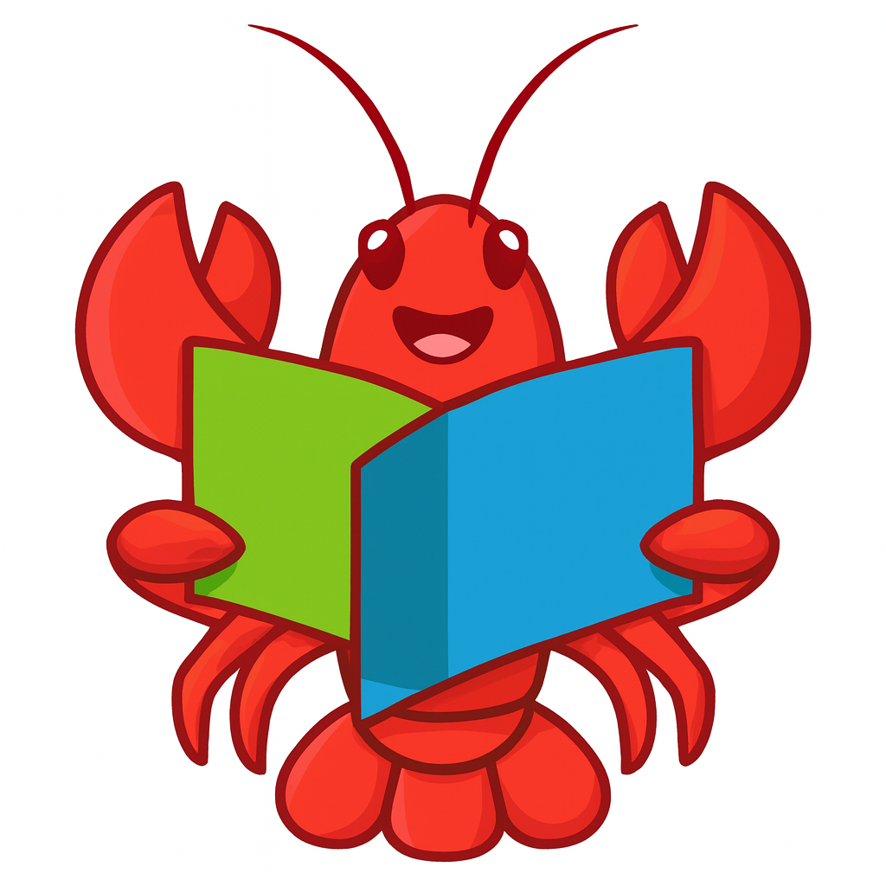

# ✨AUTO-COURSE

<div align="center">
   
</div>

本工具可以**指导** OpenClaw 给MOCC中国大学自动答题

## ❓为什么开发这个skill

虽然 [OCS刷课助手](https://ocsjs.com) 很好用，但是如果不配合题库使用，仍然只能自动刷课，但是无法自动答题。

> 这**无疑**浪费了大学生宝贵的时间去做没有意义的事情

随着OpenClaw的爆火，本工具应运而生！！

###### 大学生的双手终于要解放了！

## 💡快速上手

安装 Openclaw

> Windows安装可以参考[Windows部署Openclaw](https://chihiro.host/2026/03/02/windows%e6%9c%ac%e5%9c%b0%e9%83%a8%e7%bd%b2openclaw/)

将本项目整个文件夹扔到`skills`的文件夹中。

运行命令打开TUI

```bash
openclaw gateway
openclaw tui
```

安装成功后跟他说

```text
你是一个自动答题机器人，现在新建一个浏览器窗口，我将在里面打开测试列表的网页
请使用auto-course这个技能来帮我自动答题
要求：
1. 在此页面依次点击每一章的 开始测试 按钮进入测试
2. 进入测试页面自动识别题目并帮我作答，题型有单选，多选，填空等
3. 答完题后自动点击提交按钮，点击后有一个确认对话框，点击确认
4. 提交完毕后自动返回测验列表开始下一章的测试
```

## 🐷总结

没啥好说的，祝你玩得开心~